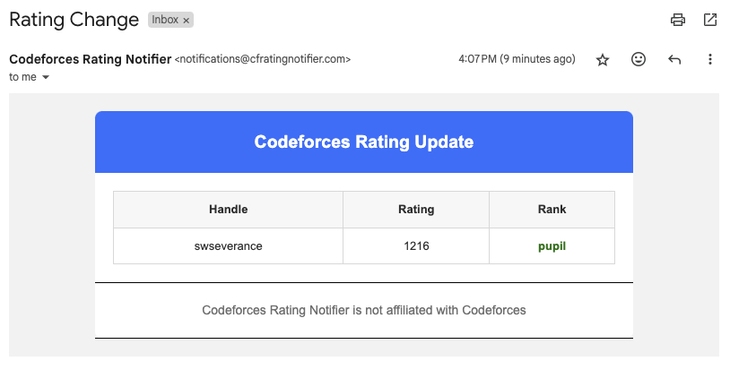

# Codeforces Rating Notifier

## Receive an email notification when your Codeforces rating changes 🚀

Q: How do I register?

A: Send us en email with your handle as the subject line. For example:

| To                                                                    | Subject     |
| --------------------------------------------------------------------- | ----------- |
| [register@cfratingnotifier.com](mailto:register@cfratingnotifier.com) | swseverance |

You will receive an email from Codeforces Rating Notifier with your handle, rating, and
rank every time your rating changes. You will also receive this information when you
register for the first time.

Q: Why didn't I receive an email?

A: Please check your Spam folder. Also, emails sent anywhere other than register@cfratingnotifier.com will
be ignored by the system. If you still didn't receive an email please create an issue on Github with your handle.

Q: Can I subscribe to receive notifications for multiple handles?

A: No. There are no plans for this feature.

Q: I subscribed with the wrong handle, what do I do?

A: Just send another email using the correct handle.

Q: Is this affiliated with Codeforces?

A: No.
